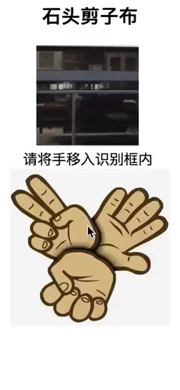
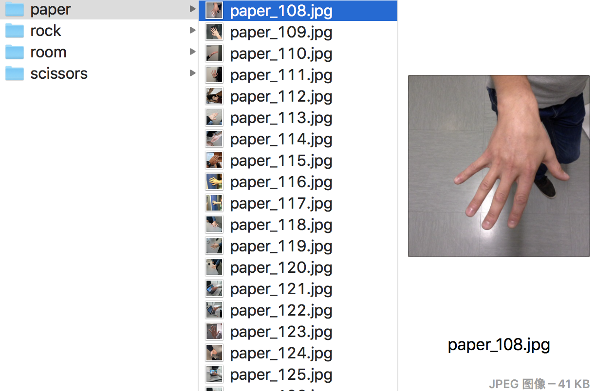
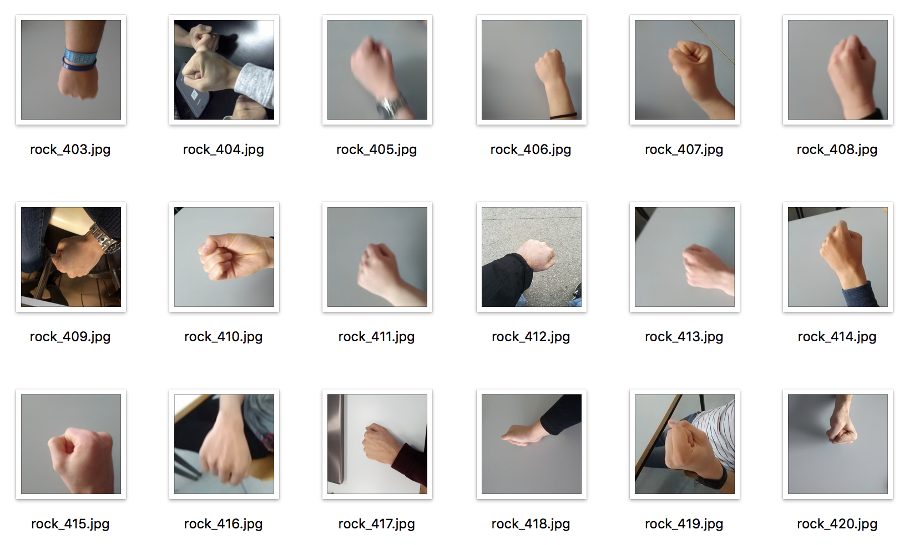
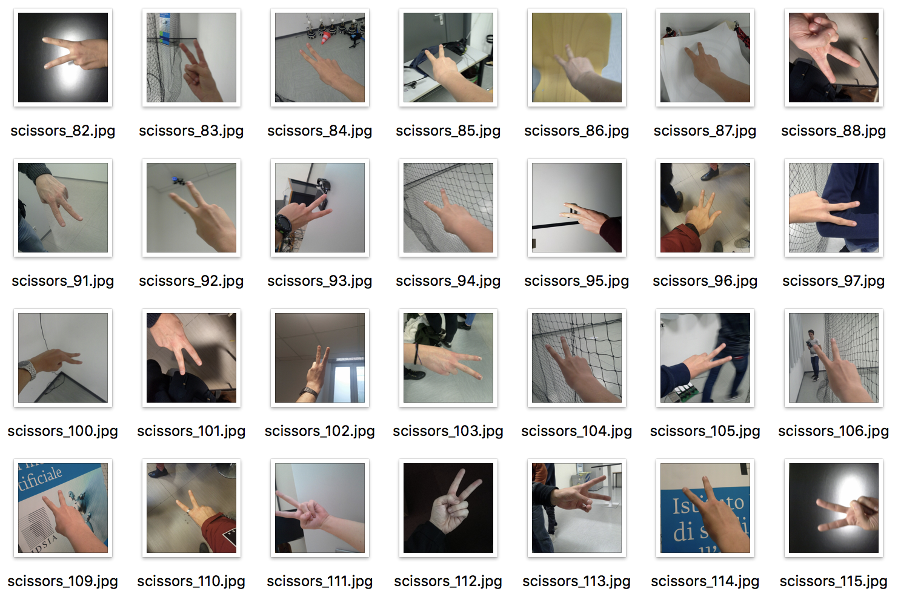
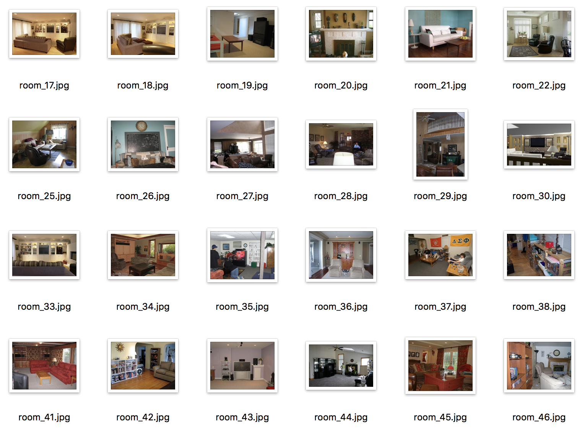

# 开发石头剪子布手势识别应用

在了解到深度学习(DNN)有卷积神经网络(CNN）和循环神经网络(RNN）两种典型的网络之后，我在想能用深度学习做个什么应用练练手呢？然后发散思维想了几个应用场景，比如古董珠宝识别鉴定、石头剪子布手势识别等。后来觉得石头剪子布手势识别是可以落地的，于是就动手做起来。俩礼拜后应用做出来了，效果非常好，如动图所示。

因为项目基本是基于开源程序完成的，所以我也把完成的项目开源到Github了，[项目链接]()。
下载代码后，切换到代码目录运行：
`python3 -m http.server 8898`。
使用PC端Chrome浏览器访问（其他浏览器不支持）：http://localhost:8898/webapp/rps.html 。

下面介绍应用的开发过程。

### 可行性分析
石头剪子布是非常典型分类任务，输入一张图片输出一个分类。因为本人是新手，不清楚开发深度学习应用会有多困难，所以我先在网上搜索别人完成的类似工作做参考。找到了几个类似的参考项目：

1. [瑞士Dalle Molle研究所石头剪子布手势识别项目](https://github.com/alessandro-giusti/rock-paper-scissors)。这项目以科普为目的，提供了论文，非常适合新手学习。缺点是从零开始搭建、训练模型，识别准确率不够高。这个项目发动了群众在各种场合收集了几千张图片数据，所以本项目手势图片数据来源于此。
2. [火箭工程师做的石头剪子布手势识别项目](https://github.com/DrGFreeman/rps-cv)。这个项目没使用深度学习而是用传统机器学习的支持向量机（SVM）完成，此项目专门用3D打印做了带摄像头的识别架子，特点是软件硬件相结合。
3. [Kaggle鱼类识别比赛优胜项目](https://github.com/pengpaiSH/Kaggle_NCFM)。此项目的思路是通过对开源的预训练VGG模型做Fine tune完成识别任务。此项目的任务和石头剪子布识别任务非常相似，因此代码主要基于此项目。

有了这三个项目作参考，同时还找到了数据，对完成项目有了信心。计划用第3个参考项目的Fine tune思路去训练第1个参考项目的数据，应该能得到好的结果。

### 获取及清理数据
从第1个参考项目得到了两千多张训练图片样本。图片里大概有十几张类别分错了，所以得先手工清理数据。石头（Rock）剪子（Scissors）布（Paper）三种图的数量稍微不平衡，因为神经网络对样本比例敏感，所以对这3种类别都保留了738张图片，删去多余的图片。

在后来的测试中发现还需要再加一种没有手势的背景图片。这样的话没有放入手的情况也能识别，人机交互会自然很多。设想用户应该在室内使用，所以我从image-net.org找了室内房间无人的照片做新加的无手势类别（Room）的数据集。[image-net.org房间数据集链接](http://image-net.org/api/text/imagenet.synset.geturls?wnid=n03319745)

在训练测试过程中，发现核对数据非常麻烦，需要打开图片对着训练结果表格才知道对不对。因此为了方便测试，批量地把图片全部命名成"类别+序号.jpg"。

### 训练模型
模型的训练参考了Kaggle鱼类识别比赛项目的例子，使用Keras库在预训练模型的基础上Fine tune完成。考虑要做成应用所以训练的模型不能太大，所以把上百兆的VGG模型改成了16M的MobileNet模型。MobileNet模型有上百层神经元，我去掉最后一层，并在最后接上一个4分类的输出层，训练时只训练倒数的7层神经元，其他的层的神经元冻住不变。另外，因为对训练过程不是很了解，所以修改了代码让训练的历史也存成文件好后续作分析，另外还设置把上采样生成的临时图片保存到指定路径。

训练过程遇到的问题是训练耗时非常长。我用特别小的数据集，训练一轮至少也要3分钟，而完成训练需要训练25轮。所以要等1个多小时才能出结果。放全部数据训练一轮大概要1小时，完成25轮训练要一整天。所以只能放到Linux服务器上使用 nohup xxx & 命令让程序在后台执行，然后第二天再看结果。由于训练时间太长，本来想使用专业的上采样工具imgaug扩充数据，后来觉得时间不允许也没怎么使用。

我把数据分成训练集和测试集，多次尝试后，模型经过25轮训练，训练集上准确率达0.9994，测试集准确率达0.9775。识别率已经超我的预期。我把训练的结果16M的h5模型保存下来。

随后我分析了训练的记录，发现开始2952张原始图片（约300M数据），Keras图片上采样后居然生成了263万张不同的图片（73G数据）用于训练和验证。

### 应用开发
我的设想是通过网页调取电脑摄像头，然后AI通过摄像头的信息识别用户手势。为此，我找到了一个可参考的项目Posenet（[Posenet项目链接](https://github.com/tensorflow/tfjs-models/tree/master/posenet)）。Posenet项目和石头剪子布识别完全没关系，但是交互界面和我的设想非常接近，所以摄像头获取图片数据从此项目借鉴网页代码。

大概的过程是：

1. 先把Keras训练的h5模型导成tensorflow.js支持的json格式。
2. 开发网页程序。网页程序使用tensorflow.js加载json模型，模型加载完后使用H5调用用户的摄像头，并把摄像头采集的图像法送给模型然后获取预测的分类结果。最后再根据预测的分类结果调整界面应该显示的图片。最后再不断重复做获取摄像头数据、识别、调整界面图片这一过程。

这种实现方式有个缺点。一个缺点是模型16M加载时间比较长。另一个缺点摄像头调用代码只支持PC版的Chrome浏览器，不支持其他的比如PC版的Safari和Firefox浏览器和手机浏览器等。所以只适合做演示，还不能拿去推广。

### 后续改进
1. 压缩模型的大小。现在16M的模型通过网页加载时间非常长，希望压缩到几百K，这样通过网页才可能像访问普通网页一样正常使用。可以用第1个参考项目从零搭建网络的方式实现。
2. 实现人机对战。可以在卷积神经网络的基础上增加循环神经网络，让这个AI能处理时序。这样可判断用户是否正要做出一个新手势，还是该手势已经完成。实现从手势识别升级到人类和AI玩猜拳。

